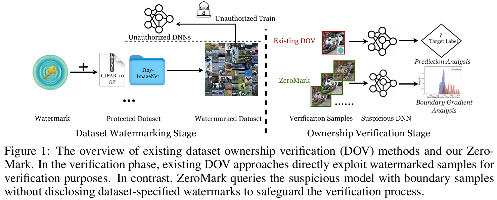
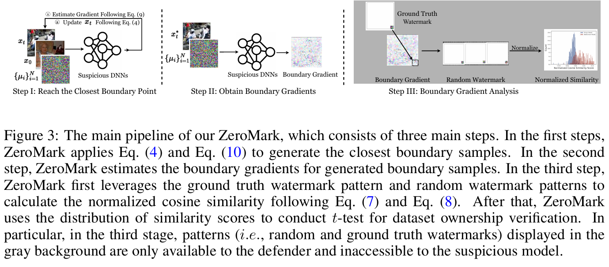
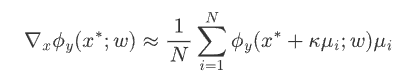
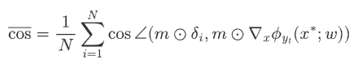
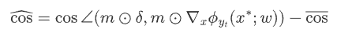
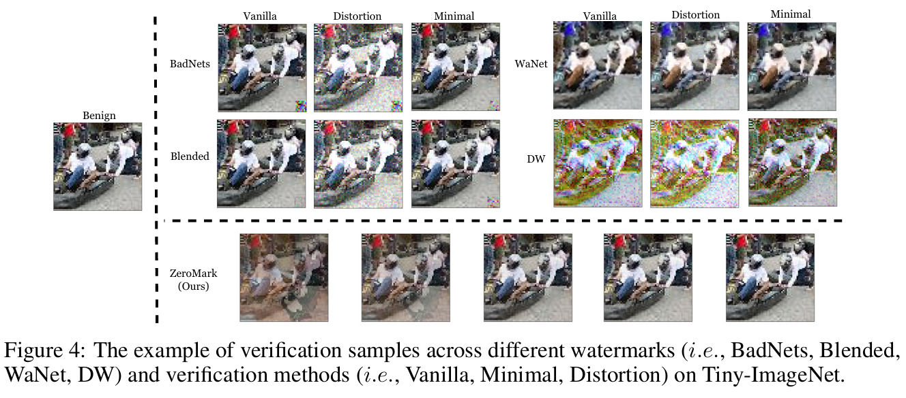

# ZeroMark: Verifying Dataset Ownership Without Revealing the Watermark

## Introduction

High-quality public datasets are one of the foundations of modern deep learning. Datasets such as CIFAR and ImageNet have helped researchers and developers train, evaluate, and compare deep neural networks. However, building these datasets often requires significant time, labor, and money. Because of this, many datasets are released only for limited purposes, such as non-commercial research.

The problem is that once a dataset is publicly available, it is difficult to know whether someone has used it without permission. Dataset ownership verification (DOV) tries to solve this problem. The basic idea is to add a hidden watermark to the dataset so that models trained on it will show a recognizable behavior later. If a suspicious model responds to special verification samples in the expected way, the dataset owner can claim that the model was trained on the protected dataset.

The paper **"ZeroMark: Towards Dataset Ownership Verification without Disclosing Watermarks"** revisits this process and points out an important weakness: most existing DOV methods reveal the watermark during verification. ZeroMark proposes a way to verify ownership without directly showing the suspicious model the original watermarked samples.

#### The Problem with Existing Dataset Ownership Verification

Traditional dataset ownership verification has two main stages.

First, the dataset owner watermarks the dataset. This can be done through backdoor-based methods or other watermarking techniques. The goal is to make models trained on the dataset behave in a special way when they see certain verification samples.

Second, the owner verifies a suspicious model. Existing methods usually do this by querying the model with the actual watermarked samples and checking whether the model predicts the watermark target label.

The paper argues that this second stage is risky. If the verification process reveals the watermark pattern, a malicious user may learn how the watermark works. After that, they could update the stolen model, remove the watermark behavior, or manipulate future verification attempts. In other words, existing methods often assume that verification is private and happens only once, but this assumption may not hold in real-world situations.

This leads to the paper's main question:

**Can dataset ownership be verified without disclosing the dataset-specific watermark?**

ZeroMark answers yes.

## Background & Preliminary works in Learned Image watermarks

ZeroMark is built on an observation about models trained on watermarked datasets. The authors find that even if the original watermark is not directly shown during verification, the model's decision boundary still contains traces of the watermark.

In deep learning, a decision boundary is the region where a model changes its predicted class. ZeroMark focuses on samples that are very close to this boundary. These are called **boundary samples**.

The paper defines the logit margin for class \(y\) as:

$$
\phi_y(x; w) = f_y(x; w) - \max_{y' \ne y} f_{y'}(x; w)
$$

If \(\phi_y(x; w) \ge 0\), the model classifies \(x\) as class \(y\). The decision boundary for class \(y\) is therefore the set of samples where the margin becomes zero:

$$
B(y; w) = \{x : \phi_y(x; w) = 0\}
$$

The important finding is that, for a watermarked model, the gradient around certain boundary samples tends to point in a direction similar to the watermark pattern, especially for the watermark's target label. The paper calls this signal the **boundary gradient**.

To measure this relationship, ZeroMark uses cosine similarity between the watermark pattern and the estimated boundary gradient:

$$
\cos \angle (x, \nabla_x f(x_t)) =
\frac{\langle x, \nabla_x f(x_t) \rangle}
{\|x\|_2 \cdot \|\nabla_x f(x_t)\|_2}
$$

In simple terms, a larger cosine similarity means that the boundary gradient points more strongly in the same direction as the watermark pattern. This is the signal ZeroMark uses for ownership verification.

This means that instead of sending the original watermarked samples to a suspicious model, the dataset owner can:

1. Start from benign validation samples.
2. Move them toward the model's decision boundary.
3. Estimate boundary gradients using only label outputs.
4. Compare those gradients with the known watermark pattern.

The suspicious model never receives the original watermark samples, but the owner can still detect whether the model carries watermark-related behavior.

## Methodology

ZeroMark operates in a **label-only black-box setting**. This is a realistic scenario where the dataset owner can query the suspicious model through an API and receive only the predicted labels. The owner cannot access model parameters, logits, internal activations, or true gradients.

The method has three main steps.

### Step 1: Generate Closest Boundary Samples

ZeroMark begins with benign validation samples and searches for versions of those samples that lie close to the suspicious model's decision boundary. Since the verifier only receives labels, ZeroMark cannot directly compute gradients. Instead, it uses a Monte Carlo estimation process to guide the search.

The goal is to create verification samples that are useful for analysis but do not visibly contain the original watermark.

Formally, ZeroMark searches for the closest boundary sample \(x^*\) of a given sample \(x\):

$$
x^* = \arg\min_{\bar{x}} \|\bar{x} - x\|_p
\quad \text{s.t.} \quad
\phi_y(\bar{x}; w) = 0
$$

Because ZeroMark works in a label-only black-box setting, it approximates the update direction through random perturbations:

$$
x_{t+1} =
\alpha_t x_0 + (1 - \alpha_t)
\left(
x_t +
\beta_t
\frac{
\frac{1}{N}\sum_{i=1}^{N}\phi_y(x_t + \kappa \mu_i; w)\mu_i
}{
\left\|
\frac{1}{N}\sum_{i=1}^{N}\phi_y(x_t + \kappa \mu_i; w)\mu_i
\right\|
}
\right)
$$

Here, \(\mu_i\) represents random Gaussian noise, \(\kappa\) controls the perturbation size, \(\beta_t\) is the step size, and \(\alpha_t\) keeps the updated sample close to the decision boundary.

### Step 2: Estimate Boundary Gradients

After finding boundary samples, ZeroMark estimates the boundary gradients around them. These gradients describe how the model's decision changes near the boundary.

Even though the real gradients are unavailable in the black-box setting, the method approximates them by querying the suspicious model with small random perturbations and observing the predicted labels.

The estimated boundary gradient is:

## Step 3: Analyze Similarity with the Watermark Pattern

Finally, ZeroMark compares the estimated boundary gradients with the dataset owner's known watermark pattern. It calculates cosine similarity scores and normalizes them using random watermark patterns as references.

The paper normalizes the cosine similarity by comparing the real watermark pattern $\delta$ with random watermark patterns $\delta_i$:

Then it computes the normalized cosine similarity score:

Here, $m$ is the watermark mask, $\delta$ is the real watermark pattern, and $y_t$ is the watermark target label.

If the suspicious model was trained on the protected dataset, the similarity for the watermark target label should be significantly higher than for benign labels. ZeroMark then uses a hypothesis test to decide whether the model is likely to have used the protected dataset.

This is the core advantage of the method: the watermark pattern is used by the defender for analysis, but it is not disclosed to the suspicious model during verification.

## Experimental Results

The authors evaluate ZeroMark on CIFAR-10 and Tiny-ImageNet using ResNet models. They test the method with several watermarking techniques, including BadNets, Blended, WaNet, and Domain Watermark.

The experiments are designed to answer two main questions.

First, does ZeroMark reduce watermark disclosure during verification? The results suggest that it does. Compared with directly using watermarked samples, ZeroMark produces verification samples that are much less similar to the original watermark samples. The paper evaluates this using metrics such as mean square error, neuron activation similarity, and mutual information.

Second, can ZeroMark still verify dataset ownership accurately? The results show that it can. In the malicious scenario, where a model is trained on the protected dataset, ZeroMark produces strong verification evidence with very small p-values. In independent scenarios, where the model is not trained on the protected dataset or uses a different watermark, ZeroMark avoids false ownership claims.

The paper also includes ablation studies. Increasing the number of optimization iterations improves the separation between watermarked and benign models. The method remains effective with different numbers of verification samples. The authors also test resistance against adaptive strategies such as fine-tuning and model pruning, and ZeroMark remains relatively robust.

## Limitations

The authors are clear that ZeroMark is an early step toward more secure dataset ownership verification, and it has several limitations.

First, it requires extra verification time. Because ZeroMark must generate boundary samples and estimate gradients through black-box queries, verification can be computationally expensive. The paper reports that verification on CIFAR-10 takes around 30 minutes.

Second, ZeroMark currently works best with watermarking methods that have a predefined target label. If a watermarking method does not have such a target label, boundary gradient analysis becomes harder to apply.

Third, the paper mainly demonstrates that boundary samples empirically disclose little information about the watermark. A stronger theoretical guarantee that attackers cannot recover the watermark remains future work.

Finally, the experiments focus mostly on convolutional neural networks and image datasets. The authors suggest that ZeroMark could be extended to other architectures and data types, but this would require effective ways to find boundary samples in those domains.

## My Opinion

The main contribution of ZeroMark is that it shifts attention from watermark design to verification security. Previous DOV research focused heavily on how to embed effective, stealthy, and harmless watermarks into datasets. ZeroMark asks a different question: even if the watermark is good, what happens when we reveal it during verification?

This is an important perspective because real-world verification may not be a one-time event. A suspicious model owner could observe verification attempts, adapt their model, and try to avoid future detection. By avoiding direct disclosure of watermarked samples, ZeroMark makes the verification process more secure and practical.

Despite its strengths, I believe the paper still has the following weaknesses.

- **Limited generalizability across settings**: The method is evaluated primarily on image datasets and convolutional architectures, so its effectiveness on other data modalities and model families remains insufficiently validated.
- **High verification cost in practice**: Although the method operates in a label-only black-box setting, its verification procedure requires repeated boundary sample generation and gradient estimation, which can be query-intensive and time-consuming in realistic deployment scenarios.

## Conclusion

ZeroMark proposes a safer way to verify dataset ownership. Instead of querying suspicious models with the original watermarked samples, it generates boundary samples from benign inputs and analyzes boundary gradients. The key observation is that watermarked models preserve detectable traces of the watermark near their decision boundaries.

Through experiments on benchmark image datasets and multiple watermarking methods, the paper shows that ZeroMark can verify unauthorized dataset use while reducing watermark disclosure. Although the method has limitations, especially in verification cost and dependence on target-label watermarks, it opens an important direction for secure and trustworthy dataset sharing.
